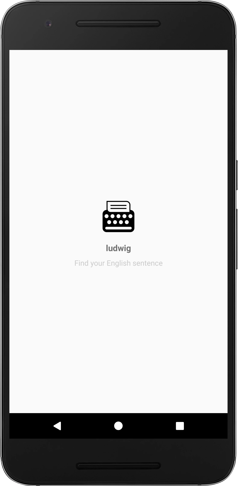
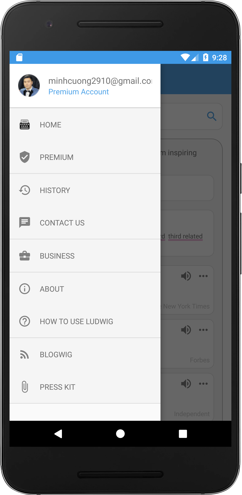
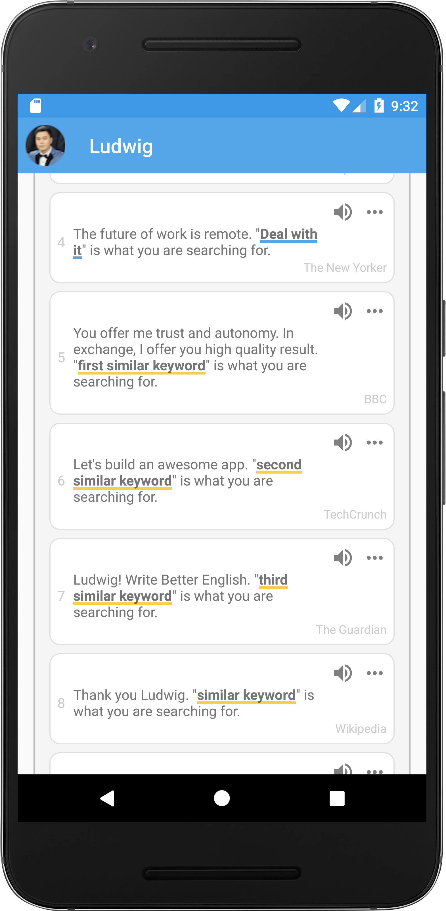

# ludwig-android

 

📦📦📦 An simple Android app for Ludwig.guru

## Major technologies

- Language: Kotlin
- Architecture: MVVM
- Android architecture components: ViewModel, LiveData, Room database
- Dependency injection: Dagger2
- Network: Retrofit, Okhttp
- Testing: JUnit, Espresso, Mockito
- Data layer with repository pattern and RxJava
- Continuous integration with [CircleCI](https://circleci.com/)
- Test report and coverage with [Coveralls](https://coveralls.io/)
- Run instrumented tests with [Firebase Test Lab](https://firebase.google.com/docs/test-lab/)

## Features

- [x] Build a scalable, testable and maintainable app with MVVM architecture
- [x] Search sentences by keyword
- [x] Show sentences with exact keyword
- [x] Show sentences with similar keyword
- [x] Show list related keywords
- [x] Show left menu
- [x] Customize Android TextView with underlined keywords (Blue for exact keywords, Yellow for similar keywords and Pink for related keywords)
- [x] Save search result to database
- [x] Write unit tests
- [x] Write UI tests
- [x] [Test coverage](https://coveralls.io/github/cuongpm/ludwig-android?branch=master) > 90% (95%)
- [x] Continuous integration with [CircleCI](https://circleci.com/gh/cuongpm/ludwig-android)

## Demo
- [APK demo](https://drive.google.com/file/d/1G_kttFkMbpjBZufwaPiF1N5_5EPWFWgX/view?usp=sharing)
- [Video demo](https://drive.google.com/file/d/11zPYUFfjR9xpSbkWukaWEAy4tQhxt5KU/view?usp=sharing)
- [API demo](https://generaldata-79d9b.firebaseapp.com/api/ludwig.json)

## Screenshots

   
